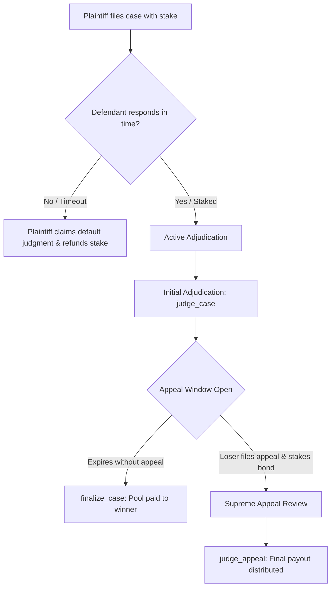

# 🛡️ GenPanel

**A Game-Theoretically Balanced Decentralized Arbitration & Escrow Resolution Protocol powered by GenLayer AI Consensus.**

🔗 **Live App:** https://gen-panel.vercel.app/
📜 **Contract (GenLayer Studionet):** `0x7Ea0Cbf560C8e04161887ddf9d9964B57a6d5109`

---

## 📌 Executive Summary
Traditional smart contracts struggle to arbitrate natural language agreements, service-level agreements (SLAs), and qualitative disputes without expensive, centralized, or slow human juries. GenLayer bridges this gap by letting decentralized AI validators reach consensus on qualitative inputs. 

However, naive arbitration protocols introduce game-theoretic vulnerabilities:
*   **Asymmetric Incentives:** Plaintiffs must post a filing fee while defendants face no economic consequences for submitting low-effort defenses.
*   **Griefing & Locked Funds:** If a defendant refuses to submit a response, the dispute remains perpetually pending, locking the plaintiff's stake indefinitely.
*   **Wall-Clock Non-Determinism:** Accessing host machine times (`datetime.now()`) outside non-deterministic execution blocks causes consensus failure during validator verification.
*   **The Clawback Dilemma:** Distributing stakes immediately after initial ruling makes appeals impossible, as funds cannot be retrieved from winner wallets once dispersed.

**GenPanel resolves these issues with a production-grade escrow and multi-tier arbitration model.**

---

## 🚀 Key Architectural Upgrades

### 1. Game-Theoretic Incentive Alignment
Defendants must post a **matching stake** (equal to the plaintiff's filing fee) to submit a defense. The winner takes the entire combined pool. This discourages frivolous filing by plaintiffs and low-effort responses by defendants.

### 2. Griefing Mitigation (Default Judgments)
Disputes are created with a customizable **resolution timeout**. If the defendant does not post a matching stake and submit a response within the timeout, the plaintiff can call `claim_default_judgment()`, which voids the case and returns the plaintiff's stake.

### 3. Escape-Proof Escrow holding & Appeal Window
Initial adjudication (`judge_case`) does not immediately distribute funds. Instead, it places the pool in escrow and opens a **24-hour Appeal Window**. 
*   If no appeal is made, the winner can call `finalize_case()` to release the pool.
*   The loser can escalate the case to a **Supreme Appeal** by posting a matching appeal bond.

### 4. Supreme Appeal Adjudication
If appealed, a higher-tier prompt is sent to the network (`judge_appeal`). It instructs the AI validators to act as an appellate court, reviewing the initial verdict and reasoning before rendering a final, unappealable decision.

### 5. Deterministic Time Parsing
Instead of using non-deterministic Python time libraries, GenPanel parses `gl.message_raw["datetime"]` deterministically. It converts the transaction ISO 8601 string into a Unix timestamp using Python's standard `datetime.fromisoformat` to guarantee consensus across all nodes.

### 6. Robust LLM Response Extractors
GenPanel features a defensive JSON string extraction helper (`_extract_json`) that sanitizes LLM output to prevent crash vectors associated with markdown formatting wrapper boxes (e.g. ` ```json ... ``` `).

---

## 🗺️ Resolution Lifecycle


---

## 🛠️ Smart Contract API

| Method | Type | Description |
|--------|------|-------------|
| `file_case(title, complaint, evidence, defendant, duration_seconds)` | Write (Payable) | Files a dispute, stakes initial escrow amount, and configures the response deadline. |
| `submit_defense(case_id, defense, evidence)` | Write (Payable) | Defendant submits arguments and must deposit a matching stake. |
| `claim_default_judgment(case_id)` | Write | Plaintiff voids the case and refunds their stake if the defendant misses the deadline. |
| `judge_case(case_id)` | Write (AI) | Runs initial AI consensus judgment, moves case to appeal window. |
| `appeal_case(case_id)` | Write (Payable) | Loser registers an appeal and posts an appeal bond. |
| `judge_appeal(case_id)` | Write (AI) | Overrules or upholds the initial verdict and distributes the entire pool. |
| `finalize_case(case_id)` | Write | Distributes escrow funds to the winner after the appeal window expires. |
| `get_case(case_id)` | View | Returns JSON details of the case. |
| `is_expired(case_id)` | View | Returns if a case has exceeded its deadline. |
| `get_charter()` | View | Returns active arbitration regulations/charter. |

---

## 💻 Tech Stack & Integrations

*   **Intelligent Contract:** GenVM Python SDK
*   **Web Framework:** Next.js (TypeScript)
*   **Arbitration Consensus:** Custom LLM-validator logic (`run_nondet_unsafe`)
*   **Network Config:** GenLayer Studionet (Chain ID `61999`)
*   **Wallet Integration:** Snap-less Metamask Switch (via `genlayer-js` provider direct binding)

---

## ⚙️ How to Run Locally

### 1. Prerequisites
Ensure you have Node.js and the `genlayer` CLI utility installed.

### 2. Deploy Contract
Initialize a local or studio account and deploy the contract with an arbitration charter as a constructor argument:
```bash
genlayer network set studionet
genlayer account unlock

genlayer deploy --contract contracts/gen_panel.py --args "1. All parties must execute services with professional diligence. 2. Failure to deliver code milestones violates the charter. 3. Spamming complaints is prohibited."
```

### 3. Deploy Frontend Dashboard
Clone this repository, navigate to the frontend directory, configure your contract address, and run:
```bash
cd frontend
npm install
npm run dev
```

Open `http://localhost:3000` to interact with the premium resolution dashboard.
